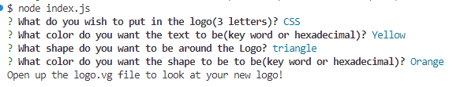
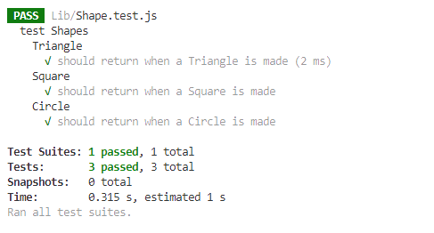
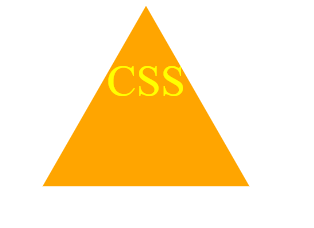

# Create a Logo

by Ethan Verellen

## Table of Contents

[Description](#description)

[Useage](#useage)

[Installation](#installation)

[Tests](#tests)

[Images](#Images)

[Contributors](#contributors)

[Links](#links)

[Questions](#questions)

[Licence](#licence)

## Description

It is a way to make a simple logo with awnsering a few questions

## Useage

Go into the terminal, use git bash or another similar program and find your way to the file.  run the code npm i, then node index.js

## Installation

To install, Either download as a zip file from the repo, or git clone in gitbash or other equivelences.

## Tests

After runing npm i, type in npm run test

## Images

## Contributing

Ethan Verellen

## Links

https://github.com/Ethan-Verellen/Create-a-LOGO

## Questions

https://github.com/Ethan-Verellen

ethanverellen@gmail.com

##Licence
    MIT https://opensource.org/licenses/MIT 
    
